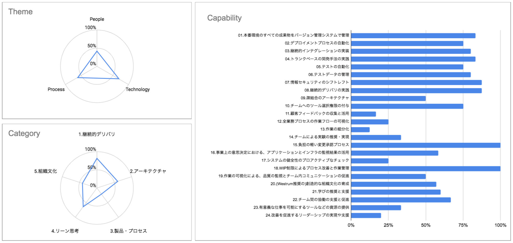

# DevOps Criteria

## 概要

事業全体のパフォーマンス、ソフトウェアデリバリのパフォーマンスを向上するために、相関関係のあるケイパビリティ群の強み/弱みを把握するアセスメントです。

統計学で関係が証明されている [LeanとDevOpsの科学［Accelerate］](https://www.amazon.co.jp/dp/B07L2R3LTN) の内容をベースにしています。

## 目的

このアセスメントを通じて、DevOpsという「ヒト、プロセス、テクノロジーを通して全体最適化を目指す思想」に賛同している方々の活動を支援したいと考えています。
実施者の「自身のケイパビリティを高めつつ、自チームや自組織の現況や目標にしっくりくる道を模索する活動」を後押しすること目的としています。

## 調査項目の構造

100個のチェックを、3テーマ、5カテゴリと24ケイパビリティ に分類しています。

### 3つのテーマ

各テーマの対象が、どれだけ事業全体のパフォーマンスを向上できる状態にあるかをチェックします。

| 項目 | 対象 |
|:---|:---|
| People | 人・組織・文化 |
| Process | 価値提供全体の業務プロセス |
| Technology | 利用しているツールや技術 |

### 5カテゴリ と 24ケイパビリティ

[LeanとDevOpsの科学［Accelerate］](https://www.amazon.co.jp/dp/B07L2R3LTN) で紹介されているケイパビリティが、どれだけ事業全体のパフォーマンスを向上できる状態にあるかをチェックします。

- 継続的デリバリ
  - 01: 本番環境のすべての成果物をバージョン管理システムで管理
  - 02: デプロイメントプロセスの自動化
  - 03: 継続的インテグレーションの実装
  - 04: トランクベースの開発手法の実践
  - 05: テストの自動化
  - 06: テストデータの管理
  - 07: 情報セキュリティのシフトレフト
  - 08: 継続的デリバリの実践
- アーキテクチャ
  - 09: 疎結合のアーキテクチャ
  - 10: チームへのツール選択権限の付与
- 製品・プロセス
  - 11: 顧客フィードバックの収集と活用
  - 12: 全業務プロセスの作業フローの可視化
  - 13: 作業の細分化
  - 14: チームによる実験の推奨・実現
- リーン思考に基づく管理と監視
  - 15: 負担の軽い変更承認プロセス
  - 16: 事業上の意思決定におけるアプリケーションとインフラの監視結果の活用
  - 17: システムの健全性のプロアクティブなチェック
  - 18: WIP制限によるプロセス改善と作業管理
  - 19: 作業の可視化による、品質の監視とチーム内コミュニケーションの促進
- 組織文化
  - 20: (Westrum推奨の)創造的な組織文化の育成
  - 21: 学びの推奨と支援
  - 22: チーム間の協働の支援と促進
  - 23: 有意義な仕事を可能にするツールなどの資源の提供
  - 24: 改善を促進するリーダーシップの実現や支援

## 利用方法

- [アセスメント GoogleSheets](https://docs.google.com/spreadsheets/d/1HlqHBWcPaE8yb0EjQmcMGymp02PI7n8qFuOUr6O5-f4/copy) をコピー
- assessment シートに回答を入力
  - 
- chart シートで結果を確認
  - 

## ライセンス

